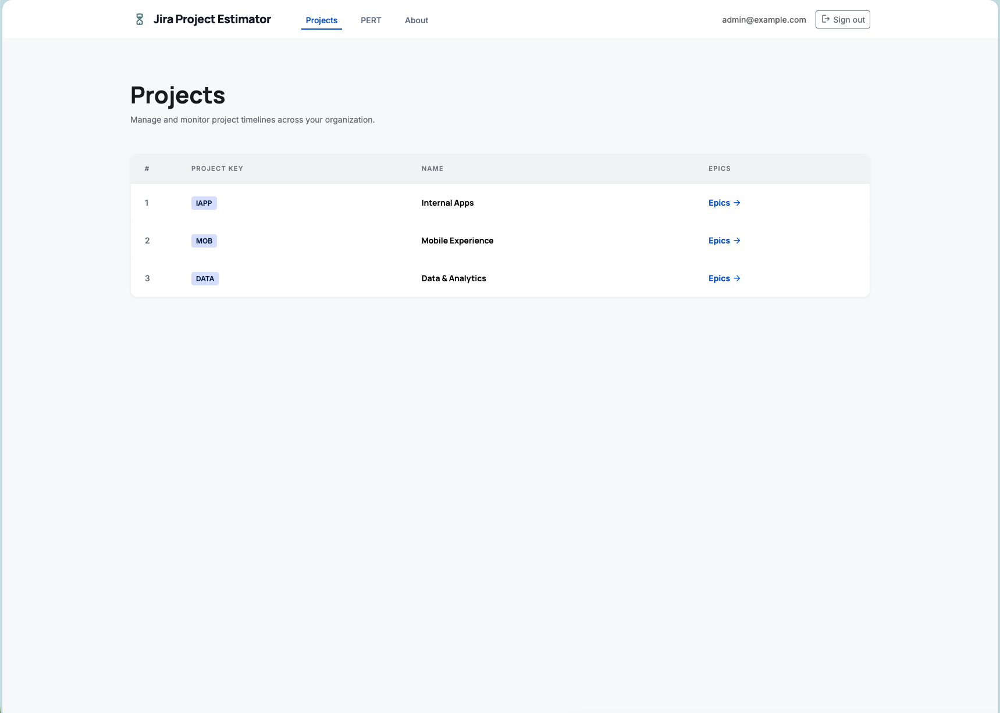
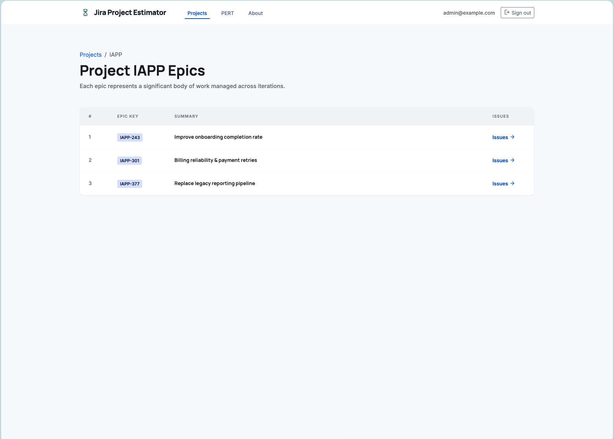
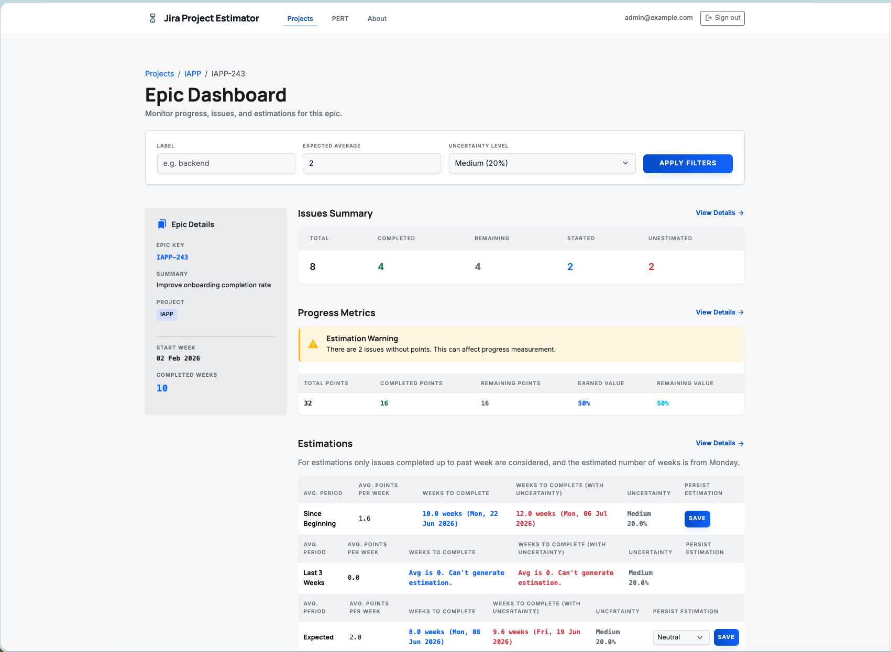
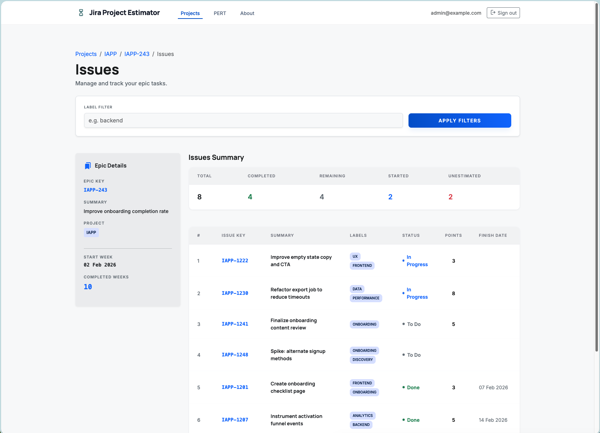
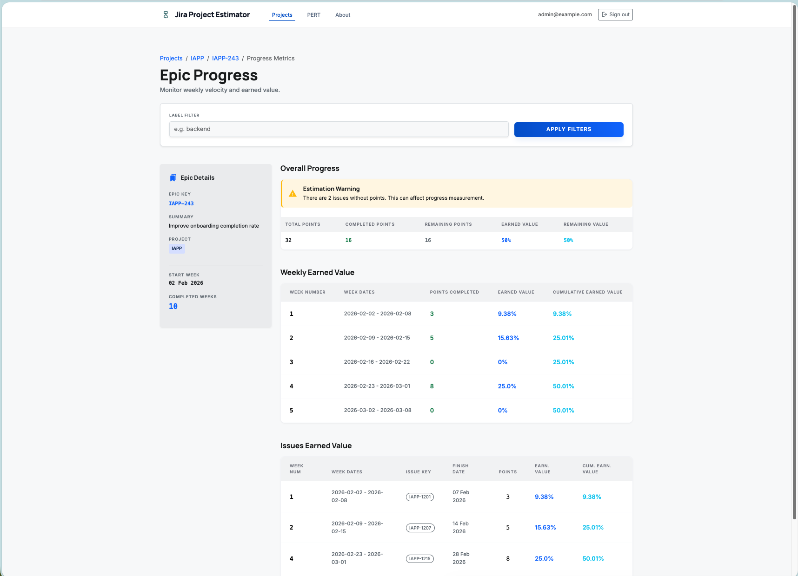
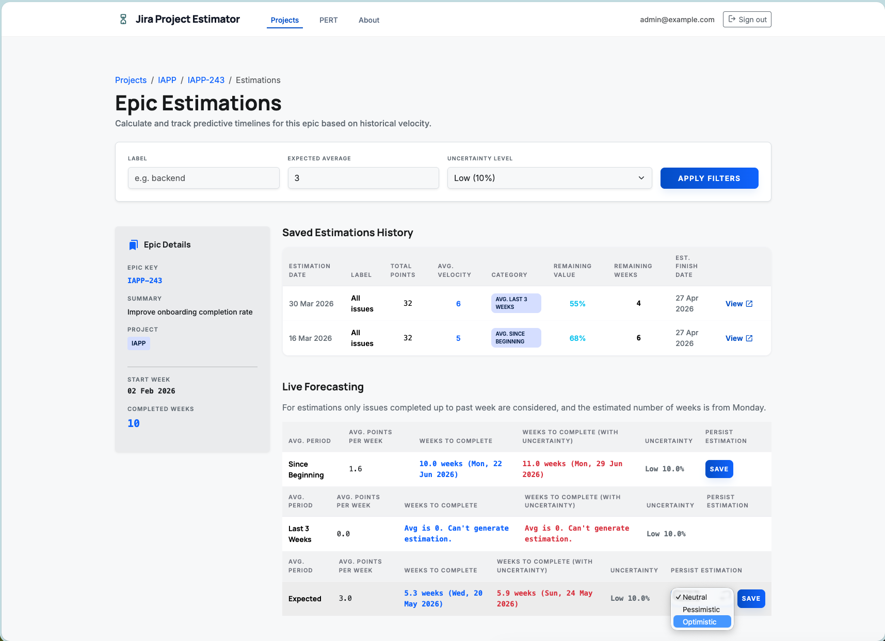
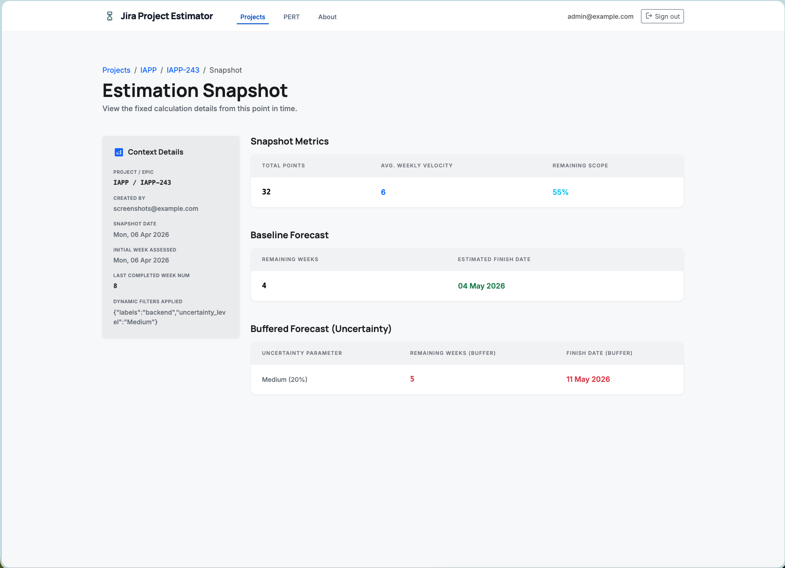
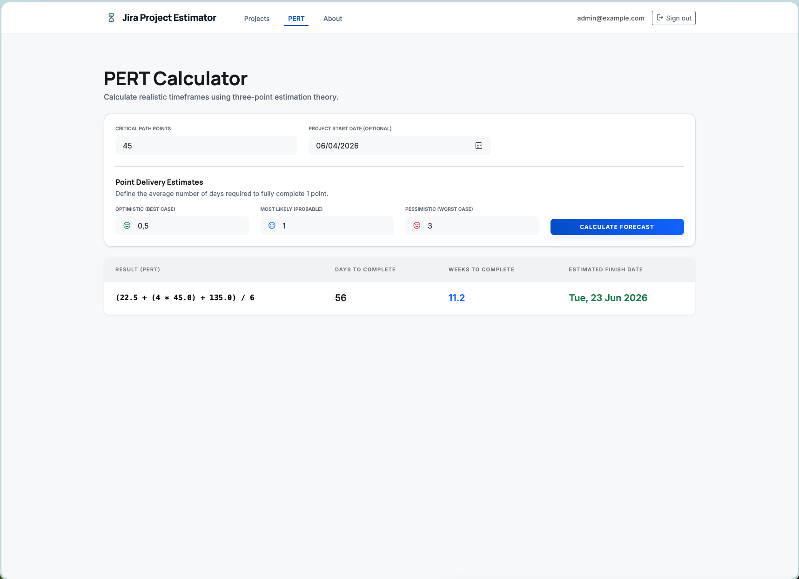

# :camera: Screens

These screenshots are meant to document **every GET page** in the app.

For consistent screenshots, the app is currently running in a **forced screenshot mock mode** (temporary) so every page renders with meaningful example data.

---

### :clipboard: Projects
`/projects`

---

### :file_folder: Project epics
`/projects/JPE/epics`

---

### :book: Epic dashboard
`/projects/JPE/epics/JPE-243`

---

### :bookmark: Epic issues
`/projects/JPE/epics/JPE-243/issues`

---

### :chart_with_upwards_trend: Epic progress
`/projects/JPE/epics/JPE-243/progress`

---

### :scroll: Epic estimations
`/projects/JPE/epics/JPE-243/estimations`

---

### :camera_flash: Estimation snapshot
`/projects/JPE/epics/JPE-243/estimations/123`

---

### :crystal_ball: PERT calculator
`/pert`

